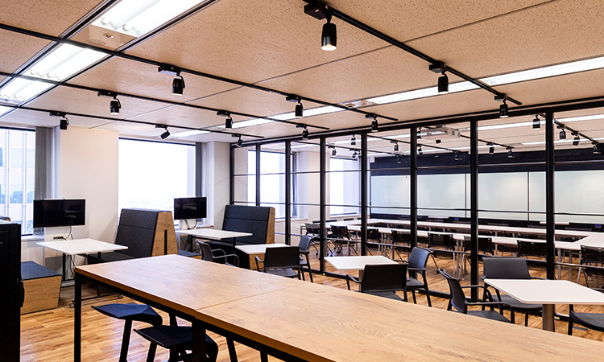
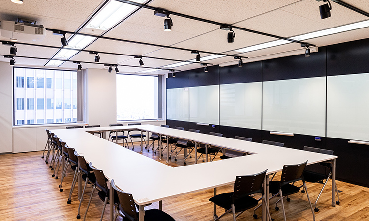
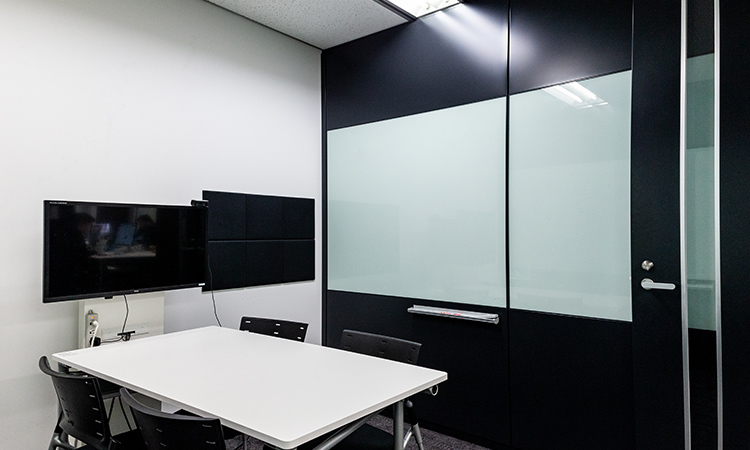
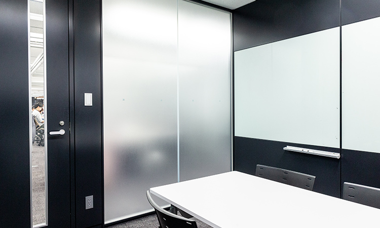

エントランスを⼊ってすぐ、フリーに利⽤可能なスペースと、その奥に⼀番⼤きなミーティングスペースがあります。フリースペースの仕切りが透明になっており、オープンな雰囲気のミーティングが可能です。
また、⼤⼈数での会議やワークショップ、イベントの際には、透明の仕切りを移動させ、より⼤きな空間の設定も可能です。
フリースペースでは、⼣⽅からパーティーや懇親などの場所としても活⽤しています。

社外のお客様をお迎えし、⼤⼈数でミーティングやワークショップをする際に使う会議室です。
窓からは、東京を⼀望出来、⾬上がりには虹が綺麗に⾒えることもあります。

少⼈数のミーティングで使う個室のミーティングスペースです。
ミーティングスペースは、個室・オープンスペース含め全てにモニターを設置しており、ペーパーレスミーティングを進めています。

プライバシーを守るミーティングも可能なよう、曇りガラス貼りの少⼈数⽤の個室ミーティングスペースも設置。