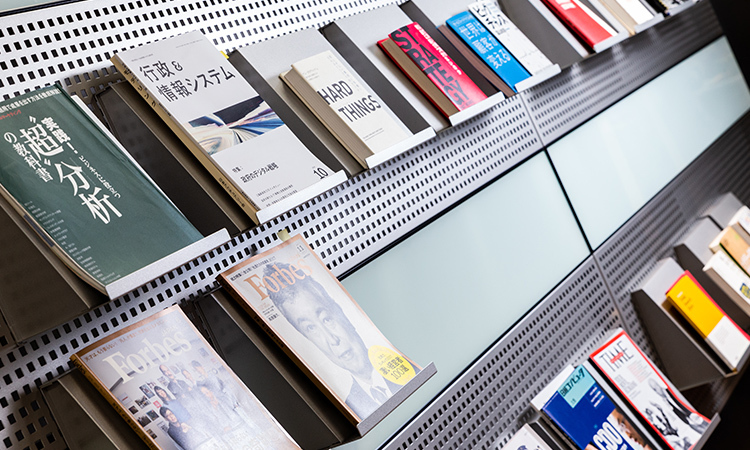

エントランスから、Office space に⼊ってすぐの壁⾯にある、各Labの拠点の世界時計。
Silicon Valley やTel Aviv のLab メンバーやスタートアップとのコミュニケーションも多いので、現地の時間を意識出来るよう⽬につく場所に世界時計を掛けています。

フリーアドレスを採⽤しており、服装もカジュアルです。

Office space の脇にある Book コーナーには、デジタルに関する雑誌や本、Lab のトップである CDO の楢﨑浩⼀が掲載された雑誌などが。仕事の合間に雑誌を⾒ながら⼀息ついたり、雑誌を介したコミュニケーションなどの場として利⽤しています。