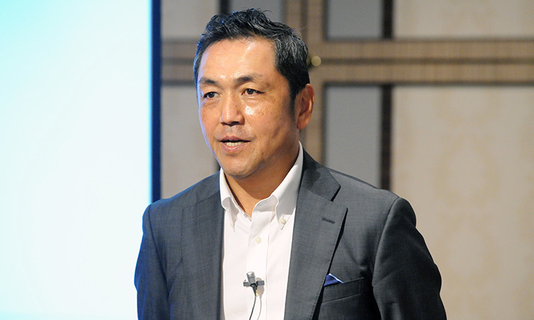
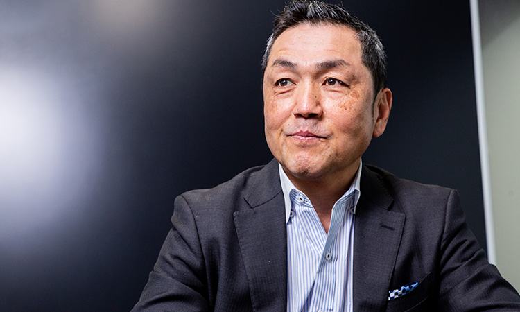

## たくさんの失敗を恐れず、それを成功に変え、 新しい「安心・安全・健康」に資するサービスを

損保ジャパンは、日本初の火災保険会社を前身に持つ、100年以上の歴史のある損害保険会社です。 こう言うと、古くてお堅い会社という印象を持つかもしれませんが、SOMPO Digital Lab（SOMPOホールディングス デジタル戦略部）は、その印象を大きく変えると思います。

 
私は、2016年5月にCDOに就任しましたが、その前は20年間大手商社に勤めていました。シリコンバレー駐在時代にスタートアップの世界に魅せられ、商社マンの肩書きを捨て、スタートアップの世界に飛び込み、その中で得た価値観、感性、組織構造による「世界最先端のデジタルイノベーション」を、東京でも実現するために立ち上げた組織が、SOMPO Digital Lab Tokyoです。

 
このラボは、様々なバックボーンを持つメンバーたちが、チームを組んでプロジェクトに取り組んでおり、そこには大企業にありがちな上下関係や組織間を忖度するようなリミッターもありません。
やりたい企画があれば、組織の全員が自由に提案できる場もあり、そこで価値を認められれば、すぐにでも実現に向けて動き出すこともできます。実行力次第でなんでも挑戦できる環境である、つまり、「ドアはワイドオープンである」ということです。

 
Digital Labでは、ビジネス部門と連携し、短期間で価値のあるソリューションを実現するため、アジャイル開発の手法を用いて自ら開発もしています。
新たなプロダクトを妄想し、一気に開発してしまうというような熱狂的な人、ソフトウェアの品質を保ち、スケールさせていく人、エンジニア組織をまわす管理者という存在や、他にも、新しい企画を立てることが得意な人や、マーケティングやWebなど特定の分野に強みを持つ人材にも力を発揮してほしいです。

 
保険会社に就職した、というよりは、SOMPO Digital Labというスタートアップに入ったと思えるような「常識にとらわれすぎない、イノベーティブな人」、「次のCDOを担えるのは自分だ」という気合いと気概を持った人。
そんな人もウェルカムです。

 
保険の枠を超えた取り組みができる当社の事業なら、たくさんの人たちの涙を減らし、笑顔を増やせる。それは仕事としてエキサイティングだと思いませんか。
私たちは、世の中の安心・安全・健康に役立つ製品やサービスを、デジタルの力で片っ端から作り、世の中に出していこうと思っています。
前向きで、失敗を恐れず、楽しみながらチームで共創していける。そんな人を募集中です。 一緒に、SOMPOで新しいものをつくりましょう。

グループCDO執行役常務　楢﨑 浩一