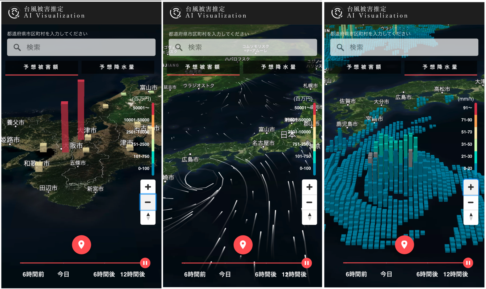
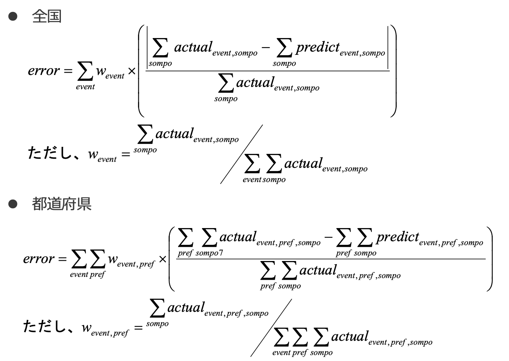

<h3>防災意識を拡散する”災害の見える化”アプリ</h3>

例年の台風による大規模被害は、全国のニュースを騒がせています。それらによる大規模な被害を避けるためにまず必要なのは、私たち一人ひとりの防災意識です。そのためには、誰もが台風被害を”自分ごと”としてとらえられる意識を生むきっかけが必要となります。

 

このアプリでは、台風データをもとに地図上に風量や降水量をビジュアル化。加えて、地区ごとの予測被害金額まで算出することで、災害の規模をリアルに伝えます。そのバックボーンとなる被害データは、気象ビッグデータを用いて当社が独自に開発した台風被害推定AIが推定します。

 

ユーザーは表示された地図を自由に拡大・縮小し、生活圏の被害予測を確認できます。また、各地の予測の詳細レポートをLINEで共有可能にすることで、ユーザー間の情報交換を促進するようデザインしました。

 

災害をリアルにとらえ、身近な人と共有し、防災意識を高めていく。一人ひとりの意識を変えるビジョンを”災害の見える化”で描きます。

|||
|---|---:|
|<h4>”見える”データ</h4>
地図上に風や降水量の予測を可視化。ユーザーは自由に移動や拡大・縮小することで、身近な地域の予測状況をリアルに確認することができます。
| |
| |<h4>地区ごとの予測被害金額</h4>
気象ビッグデータを活用した当社独自のAIエンジンにより、保険金の支払額を予測。その精度は、全国規模予測で実被害との誤差3.4%以下という水準を達成しました。  ※上陸3日前時点の気象情報をもとに推定
|
|<h4>レポートの共有</h4>
AIが推定した予測被害の詳細レポートは、アイコンからLINEで共有可能。手軽に危機感を共有し、防災意識を高め合うことができます。
| |
