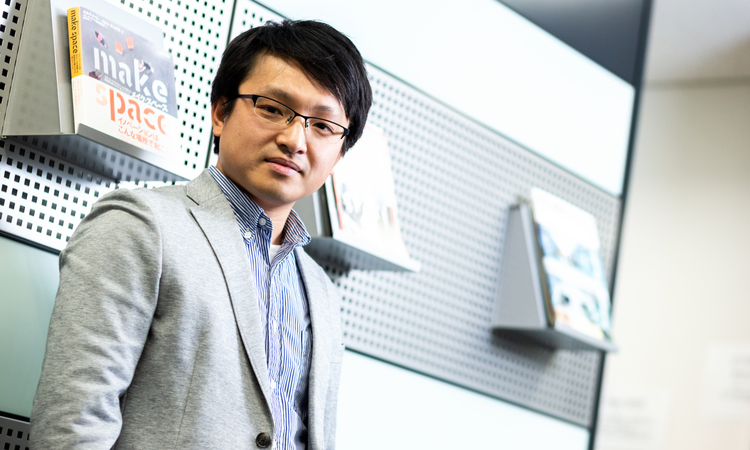

## 「幅広い先端技術を高速で試す技術者集団」で得られる成長

このデジタル戦略部にジョインしてから約1年ですが、当初に担当した[「Future Care Lab in Japan」](https://www.sompocare.com/feature/efforts/company/201903/)の自動運転車椅子案件をはじめとして、様々なPoC案件に参画してきました。それらの経験を踏まえて、この職場の印象を一言で表すならば、「幅広い先端技術を高速で試す技術者集団」というのが率直な感想ですね。

前職は大手電気機器メーカーで信号処理などのアルゴリズム開発を行う担当でした。その経験を活かし、現在も主にAIやアルゴリズム開発を担当するエンジニアとして参画していますが、前職と大きく異なるのがその「スピード感」です。過去のアルゴリズム開発では、短くとも数ヶ月の期間をとっていましたが、当部署は2週間単位でSprintを次々と回し、成果物を生み出していく。

この両者の違いは単に指向の相違であり、どちらが良いかという話ではありません。ですが、確実に言えるのは、これからのAI、アルゴリズム開発にはクラウドの知識、活用が不可欠であるということ。クラウドの進化に追従し、実際に触りながら、高速で開発を続けるという今のスタイルのほうが、技術者として成長していると実感しています。

## 前職から活かせた経験と、現在学んでいること

PoCで扱うジャンルが多岐にわたるので、何らかの得意分野をお持ちの方は、直接そのスキルを発揮できると思います。私自身の経験でいえば、まずは台形補正などのOCRに関する技術。保険業界の業務は、申込書や保険証券など、紙が関わる局面がまだまだ存在します。OCRに関する技術ひとつでも、複数の保険事務に対する様々な業務改善提案における「核」になります。

その他には、先にも触れた[「Future Care Lab in Japan」](https://www.sompocare.com/feature/efforts/company/201903/)の自動運転車椅子の事例も同様です。前職でセンサーデータなどを扱ってきた経験がそのまま活きたことで、ごく短期間のSprint開発で実現したものが、ニュース番組などの各種メディアで紹介される成果となりました。

一方で、これまで一般のネイティブアプリ開発などの経験がなかったので、そこは業務の中で学ばせていただいています。今後参画される方にも、ぜひこれまでのご経験から強みを発揮していただきながら、弱かった部分は補強していき、成果を出しつつ一緒に成長していきたいですね。

## 自由な組織だからこそ生まれる自主性と、若い組織で求められる役割

前職が研究職だったこともあって、当社の自由さは結構衝撃でした。フロアは開放的な配置で席もフリーアドレスですし、休暇取得もしやすく快適です。開発ツールも全員にMacと外付けモニタが支給され、クラウドも自由に使えるサンドボックス環境が用意されています。Slackを始めとしたコミュニケーションツールやプロジェクト管理ツールも豊富に採用されていますので、設備に対する不満は思いつきません。

特に生活が変わったのはテレワークの奨励ですね。子供が急に熱を出したときにも、Slack一本で自宅勤務に切り替えられるというのは、家族持ちには大変ありがたいです。

自由な環境である分、個々人が自立し、主体性をもってPoCを進めているのを見ると、トップダウン的なプロジェクト進行であった前職との違いを、社員のマインド面でも強く感じています。

ただし、そのように自由な文化を持てるほど、このデジタル戦略部という組織自体が若い分、老舗メーカー企業には必ず存在する「その道のプロ」が不在であるのが、この部署の弱みであると思います（保険などの業務面ではいるのですが）。逆に言えば、自分たちの活躍する余白のある組織であるのだと思いますし、自分が第一人者になることで何千人ものグループ社員に影響を与えられると思うと、それはそれで励みにもなっていますね。

## 「アジャイルAI開発」の時代に向けて
将来のビジョンですが、もともとヘルスケア関連の開発担当を志望して入社しましたので、そのジャンルのPoCを今後も継続していきたいと思っています。加えて、「最先端技術のキャッチアップと共有」が自分のミッションだと思っていますので、よりAIを取り入れた開発を推進したり、それをセミナーのような形で社内教育につなげていきたいですね。

さらなる未来の展望として、大胆な未来予測にまで踏み込めば、おそらく5年後、10年後にはAI関連の開発インフラが今以上に普及していると思います。例えば、当たり前のように学習モデルがそのあたりに転がっているような。そうなれば、それらのリソースを活用した迅速なAI活用を行う、いわば「アジャイルAI開発」のような手法が出てきたら面白いのではと。デジタル戦略部にいれば、その基礎となる「アジャイル」も「AI」も最先端のキャッチアップができますので、今は来るべきそのときに向けて、成果を出しながらスキルを磨いています。

