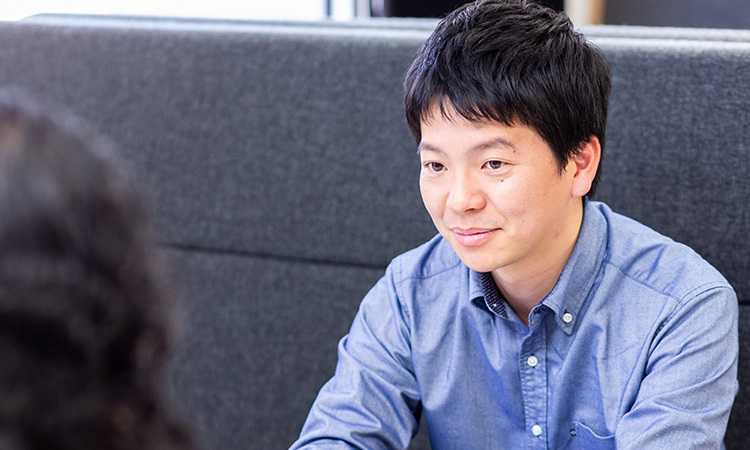
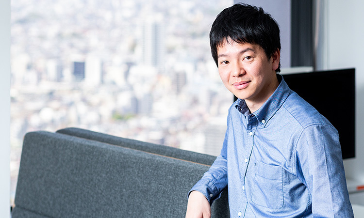

## 学生時代から一貫してきたIoTやロボティクスへの想い

学生時代からIoTやロボティクスに興味を持ち、大学・大学院共にロボティクスを専攻しました。
しかし、卒業を迎える頃の日本は景気が落ち込み、大企業はロボティクス分野への投資から次々に撤退していました。そこで官民のプロジェクト両方に携わることができるシンクタンクに入社し、情報通信産業に関する技術のリサーチや事業戦略、技術戦略に携わりました。ただ、そこでの多くの仕事は部分的な依頼に限定され、あくまで外部からの支援であることから、新規事業の企画から事業化まで事業全体を自ら動かして行きたいという気持ちから大手情報通信会社へ転職しました。

情報通信会社の経営に近い部門で、新規事業の事業戦略や経営管理を経験した頃、学生時代からのIoTやロボティクス、スマートホームに関わる仕事がしたいという想いが再び湧き上がりました。最先端のAIやIoTなどロボットに関係する、より技術的な知見が必要とされる仕事に携わりたいという夢をどうしても捨てきれなかった。そのような想いの中でSOMPO Digital Labと出会い転職したのは1年前、34歳のときでした。

## やりたいことに取り組める環境と新たな挑戦
自身の採用面接以来一貫してやりたいと伝えていることは、「IoT」「AI」「ロボティクス」の３つです。現在は、その３分野に関係する「保険」と「介護」の２事業を担当しており、希望してきたやりたいことをやらせてもらえていると感じています。特に介護事業では、最先端の技術を保有するスタートアップを多数訪問し、技術情報を収集したりPoCに繋げたりと、具体的な成果につなげることが出来ています。

最新技術のリサーチにも興味があるのですが、CES（毎年ラスベガスで開催されている最新技術に関する展示会）にも参加させてもらうなど、リサーチや企画において自由度はとても高いと感じています。CESでは、会場内を走る自動運転自動車や、様々なジャンルの最新技術を目で見るだけでなく体感する形で触れられて、貴重な経験が出来ました。

大きなやりがいを感じる一方で、担当する事業部（ビジネス・サイド）のスピード感に物足りなさを感じることもあります。金融業に特有の慎重さや確実性を重視する文化が根付いており、変化の大きいIT領域で求められる「とりあえずやってみよう」「走りながら考えよう」といった思考やカルチャーを育む余地がまだまだあると感じます。

そんなときは「XXではこういうやり方をしていたので大丈夫です。まずはやってみましょう」と事業部の背中を押すなど、これまで実際に得た経験を活かし、説得力をもたせながらプロジェクトを推進しています。事業そのものに関わる仕事に加え、自身の経験に根差した仕事の進め方を共有し、カルチャーを一緒につくっていけることもやりがいを感じています。

また、スピード感を上げるためSprintチーム（内製開発部隊）を活用したプロジェクト推進も行っています。システム開発などを内製化することで、コストを圧縮しながら現場の課題を都度反映させ、スピーディーに開発を進めることができます。自動運転車椅子の開発は、Sprintチームの活用事例の一つです。車椅子と自動運転の組み合わせはロボティクスの研究開発を活用した事例でもあり、このような事例を今後も増やして行きたいです。

## 大企業だからこその強み、そして今後の展望
ロボットやスマートホームといった分野は、より大きな資本を投入できる大企業だからこそ出来ることがあると感じています。規模や影響力の大きい事業にチャレンジ出来るのは大企業の強みです。ある技術があったときに、それを活かす他の領域がグループ内に幅広く存在することもメリットだと感じます。
今後は、身近なB２C向けのサービスや事業に関わりながら、情報最先端のデジタル技術の活用に取組んでいきたいです。 
また、最先端の技術をキャッチアップしながら行動力を発揮できる人と一緒に、新しいことにチャレンジすることで、事業をスケールさせながら、新しいカルチャーづくりの一翼を担っていきたいです。

