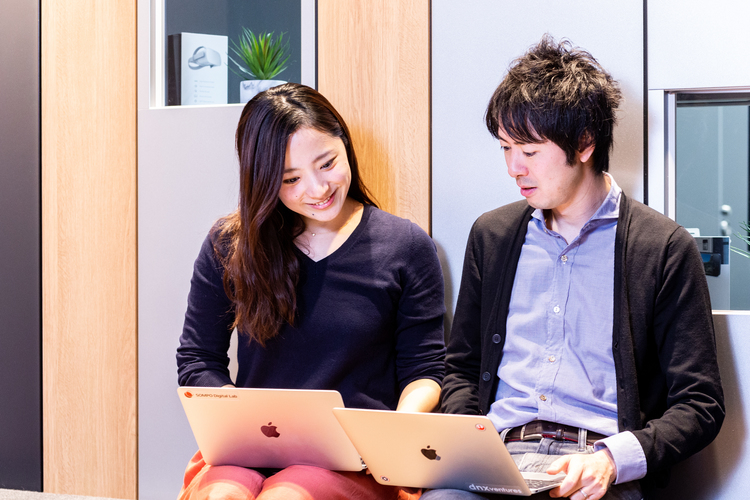
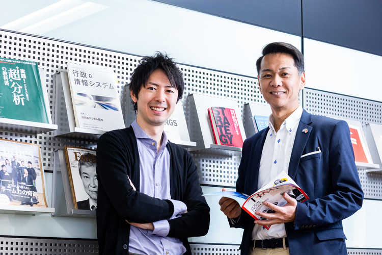

## ディスラプトされる業界だからこそ、チャレンジ精神に溢れている

SOMPO Digital Labにジョインしたのは2019年1月のこと。前職は外資系コンサル会社で、開発・技術を用いた新規事業戦略調査、社内のソフトウェア導入プロジェクトなどを手がけており、前々職の日系の電気機器メーカーではアメリカのシリコンバレーに駐在し、最新のテクノロジーを活用した新しい事業企画などを経験。

SOMPO Digital Labに興味を持ったのは、金融業こそ今後最もディスラプトされる業界だと思ったことがきっかけ。そのなかでも、チャレンジングなことをしている会社であり、部署だと思ったから。
特に、シリコンバレーで活躍していた楢崎浩一をCDOとして向かえたというのは、会社としての本気度を感じた。
ディスラプトされる業界だからこそ自らが危機感を持ち、海外駐在などで培った最新テクノロジーに関する知見や経験を活かして新しいものが作れると思ったし、活躍できる場があるのではないかと思った。

入社後現在に至るまで、保険のその先に、保険につながる新しいビジネスを作るための種まきをしている。新しい保険を作るためのその土台づくりと言い換えられるかもしれない。
Digital Labでの仕事は、仕事の仕方や服装、どこでも働ける環境など全てが自由であり、何にでも挑戦できる反面、自由すぎるために筋道や王道のやり方がなく、一歩ずつ自分で考え、迅速に進めていかなければならない側面がある。
上記を理解し裁量に任せてくれる上司の存在にも感謝をしている。
社内では、自由であることを羨ましがる人がLabの外に多く存在していることも承知している。この会社が変わらなければいけない部分でもあるかもしれないし、より成果が問われている環境とも感じている。

## お互いに刺激しあえる環境、それがSOMPO Digital Lab
ここに入社して思ったことは、メンバーがみんな優秀だと思ったこと。
一つ一つの案件に対して理屈にかなった考え方をしているし、保険×デジタルに対しての理解度の速さはすごい。
自分は電気機器メーカーのバックグラウンドがあり、シリコンバレーにも4年駐在していた経験から、デジタルについてある程度の知識を有しているが、保険については素人なので、それを他のメンバーに教えてもらいながら知識を深めるのは私にとっては刺激だ。相互にメリットを享受できるし、有益に思っている。

保険以外のバックグラウンドを持つ人も、SOMPO Digital Labであれば馴染めると思う。
保険の世界は、与えられたテーマの中で保険を作っていく。敷かれたレールの上を拡張していくイメージだが、ここでは、どこにレールを作ろうか？そもそもレールを作るのか？からおこなっていくため、アイデアを出して推し進めていける人ならば良い環境だし、必要な知識が多岐に渡るので、学べることも多いと思う。

## 社会的意義のある課題にチャレンジし続けていきたい
大企業のメリットは、多岐に渡る様々な種類のビジネスをゼロから複数同時に立ち上げられるということ。リソース面では、人材が豊富なので能力の揃ったチームを作りやすいということも大企業のメリット。ベンチャーやスタートアップは一つの業を大きくしていくということが中心。新しいものを自社内のアセットと合わせ新しいシナジーを出していったり、多角化してくということはリソース面から見ても同時進行は難しい。

今後は、IT×保険×XXといったことにチャレンジしていきたい。
今は食品、ファッション、宇宙などに興味がある。ライフスタイルの改善のみならず、社会的な基盤につながるといった、社会的意義のある、社会的問題を解決するようなビジネスをやっていきたい。
弊社の掲げる安心・安全を社会的問題を解決することで提供できれば、自分たちはインフラ、プラットフォーマーになれるのではないかと思う。
例えるならYouTuberを支える「YouTube」というプラットフォームを作る仕事を通して、社会に貢献したいと思う。

このLabで一緒に働く人は、型にハマらず、コミュニケーションを絶やさない人。リモートでも良いが、コミュニケーションが取れる人が良い。一緒の価値観を共有できる仲間は大事なので、志が一緒か？強い気持ちがあるか？気持ちが一緒か？というのが大事。一緒に悩んで、一緒に泣いて、一緒に笑って・・・全部に共感する必要はないが、様々な局面において意気投合できるか。価値観の共有ができる人。
保険のエコシステムを作ることで社会に貢献し、この社会に生きる個人が心地よく仕事ができる世界の土台になれればと思う。