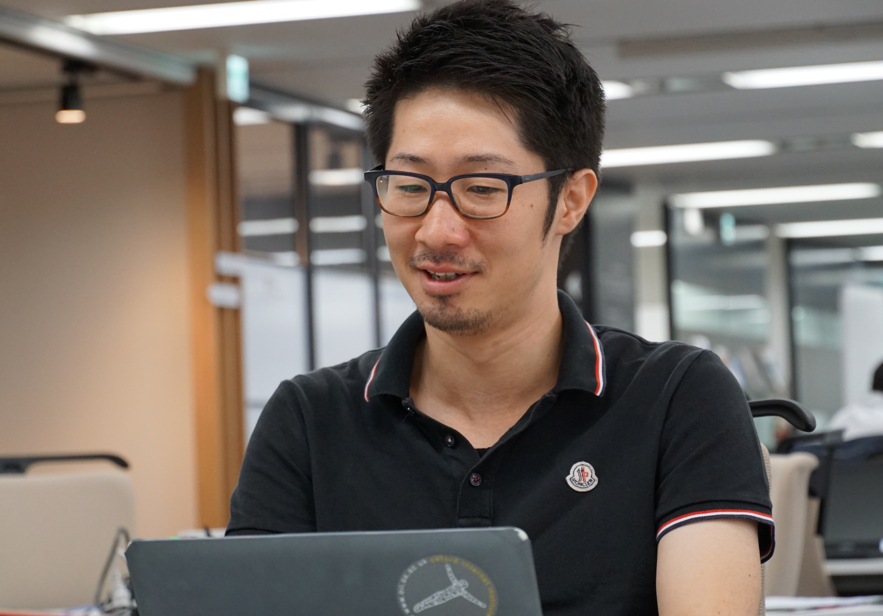
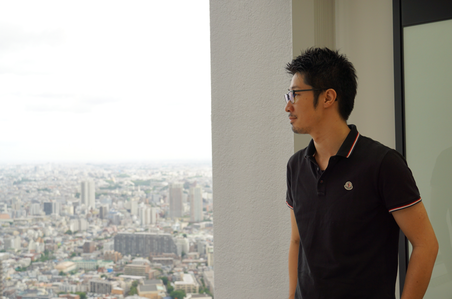

## 国から民間へ。これまで培った防災減災とデジタルのスキルとノウハウを活かせる世界への転身

2018年10月にSOMPO Digital Labのメンバーとなる以前は、国家公務員をしていた。気象庁で、技術開発、国内行政、国際行政のスキルをそれぞれ２年積み、その後２年の海外留学を経て、国家公務員というキャリアから、民間企業のデータサイエンティストへ転身。

気象庁入庁後初めて手がけた仕事は、庁内が保有するあらゆるデータを活用し、国民に役立つプロダクトの開発だった。代表的なものでは、気象庁HPにある推定気象分布（現在も公開中）という、衛星データや地理空間データ、気象観測データなど、バラバラのデータを組み合わせて使い、気温や天気分布をメッシュ情報で見せるプロダクトのアルゴリズム開発だ。

十数名の技術開発チームの中で、推定気象分布の主担当として、C++言語を使い、ほぼ一人で開発した。
その後は、自治体が防災減災対応をしていくための国のフレームワーク作りや、アジア太平洋地域の発展途上国の防災政策アドバイスやトレーニングなどを担当し、そこからICT技術やデジタル、テレコミュニケーションが大事だと思うようになった。

災害のインパクトや、防災減災のデータ収集やフレームワークづくりは、国が主体的にやってきたが、防災減災を事業として引っ張っていけるのは民間企業だろうと思った。
防災減災といえば損害保険、その中でデジタルの取組みをしている部門（Lab）がある会社ということで、防災減災とデジタルを組み合わせた活動が出来る民間企業であるSOMPOグループのデータサイエンティストに転身することを選択した。

当初は転職する気は全くなく、転職情報を検索していた妻が見つけてきた、“データサイエンティスト”というキーワードに反応した。当時データサイエンスについて勉強していたので。
海外では、スタートアップがイノベーションを起こしたり、世界を変える。と言われているけど、日本はまだまだで大企業の方が可能性がある。大企業であっても社会を変えるインパクトを持つようなことは可能だと思う。

## 仕事の進め方のギャップ　　民間企業での仕事の仕方がわからなかった・・・
向かってるゴールが、国（国家公務員）と民間企業では全然違う。
国の仕事は、国民の幸せを求める。民間は、企業であるはゆえのビジネスとしての成功を求め、収益を求める。

今までのやり方（ゴール）と全然違うことに最初はギャップや違和感を覚え、仕事の仕方がわからないとさえ思った。

国家公務員時代の仕事は、予算のための理由を並べ、フレームワーク化して世にばらまく。そのため仕事のウェイトは、予算を取るための理由づくりが大半を占めていた。

今は、実務に落とし込んで結果が出るもの。さらに効果の大きいものから優先順位づけをして進めていくし、結果を求められる世界だと感じている。

国のやり方を学び、今、民間企業のやり方を学んでいて、いかにそれを組み合わせられるか。社会に受け入れられる会社を作っていくということは、サステナブルな経営という意味では必要な視点だと思っている。優秀な人材もその方が集まる。

2019年度からデータサイエンティストも拡充され、チームも大きくなり、2020年度には部としてさらに大きくなる。

グループ内にあるデータにどう価値を持たせていくか、そしてデータガバナンスをどうしていくか？について検討と実行を加速していく。

今のチームはフラットな関係で人と話せ流。物理的な環境もそうだし、ミーティングそうだし、言いたいことも言える環境にある。

実務に落とし込むこともやりつつ、大局的な大きな観点も忘れずに、社会の中でも役立つ。社会にインパクトのあることを、ボトムアップでやっていきたい。

## 海外留学で大きく変わった価値観、そしてこれから・・・
国家公務員時代の２年の海外留学で価値観が大きく変わった。
１年目は気象学で有名な大学、レディング大学へ、２年目はオックスフォード大学に通ったが、日本と海外で大きく違うと思った点は、みんな夢を持っていて、個々の目標も持っていること。本来の目的とか自分はどうしたいか？の質問に答えられなかった・・・

自分は留学したら、その国で“一番の大学”に行きたかったので、オックスフォード大学を目指した。

オックスフォードでは、タキシードとガウンを着た正装をして、寮単位に食事をし、インターディプショナリー（interdisciplinary）な議論をする。優秀な人ほど野心が大きく、有名かつ人気の寮は、そういう人が集まっており、みんなその寮に入ることを目指している。

海外で活躍しているのは、マインドセット、ビジョンをしっかり持っている人。これを持つことが重要。まずは大きなゴールを掲げる。個の目標やゴールを持って欲しい。そういう人にSOMPOに来て欲しいし、一緒に働きたい。

これまで身につけたスキルで役に立っていることは、公務員時代、最新の技術（スパコン、衛星技術など）を分からない人にわかりやすく説明するというスキルが必要だったが、データサイエンスにおいても分からない人に説明するシーンがあるので、役立っている。

気象情報（天気予報）においては、３０年前から予測技術を活用している。予測から意思決定につなげており、対処法なども活用出来る。今はそれを人工知能がやっている。

前職での国内・海外で得たスキルやノウハウと現職で得たスキルやノウハウを組み合わせて、データやデジタルテクノロジー（IoT）で社会にインパクトのあることをやっていきたい。

新しいことや他と違うことをしたり、組織文化を変えるのは難しいが、成功事例ができれば理解されると思う。

実務は大変かもしれないけど、社会を変えるインパクトを持つようなことが出来る環境ではあると思うので、そういう気持ちを持っている人と一緒に働きたい。 

特に、機械学習やヘルスケアの領域でエンジニアリングに明るくデータサイエンティストとして働いてくれる人に来て欲しい。
